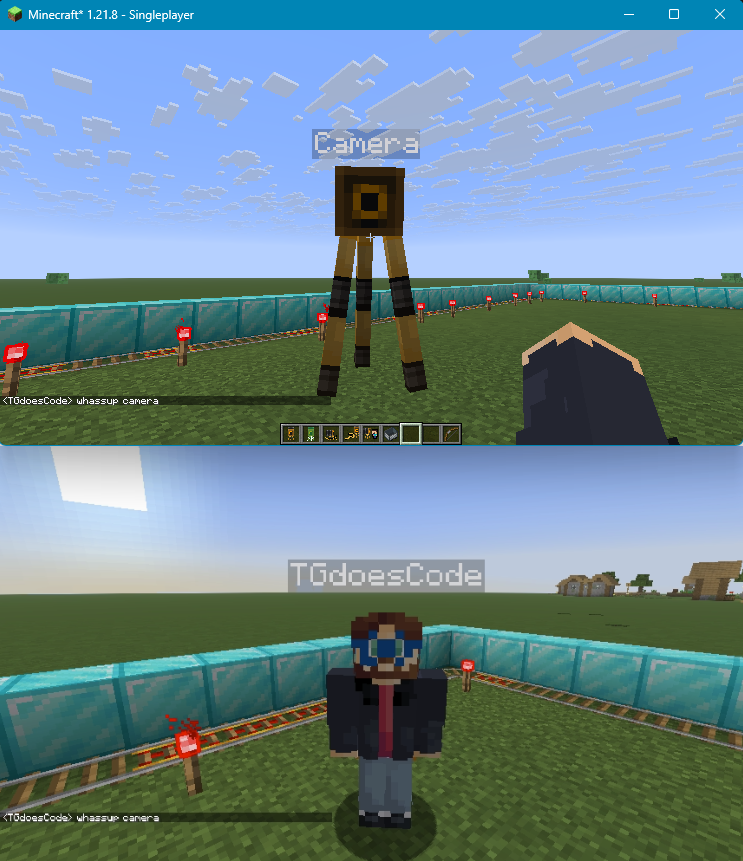

<h1 align="center">
  <sub>
    
  </sub>
  <br>
  Minecraft Virtualcam
</h1>

This is a minecraft mod for *1.21.8 Fabric*, which registers a *virtual camera* into the Windows system using [softcam](https://github.com/tshino/softcam) and streams a camera entity's rendered POV into it.

<p align="center">
  <a href="https://github.com/tggamesyt/cameramod/releases">
    
  </a>
  <a href="https://github.com/tggamesyt/cameramod/releases">
    
  </a>
</p>

<sub>Inspired by [Flashz's omegle mod](https://youtube.com/@flashzyt)</sub>
## Notice
as seen in the custom license, usage of the mod is free, you can download it from github, or [modrinth](https://modrinth.com/mod/virtualcam), but if you want to use it in videos, you have to give credit, and be a paid [patreon](https://patreon.com/tgdoescode), othervise I will take down your video.
## Setup
- Download the latest version of the mod from [here](https://github.com/tggamesyt/cameramod/releases/latest)
- Open the game with the mod, 1.21.8 fabric.
- When prompted, allow ```Microsoft® Register Server``` to run, this registers the virtual webcam.
- Restart your computer

## Usage
Once you have the *virtual camera* registered, you can just go into a world, place a camera down, and activate it using the camera activator.
I also added some utility items for rotating and moving the camera around.



## Uninstalling

if you no longer want to use this mod and want to unregister the webcam, run ```%appdata%/.minecraft_cameramod/uninstall_camera.bat```

## Development notice
when cloning the repo, if you wish to rebuild the natives (dll-s) from softcam, use ```--recurse-submodules```.
to rebuild the ```src/main/resources/natives```, run ```.\build_softcam.bat``` with **VS 2022** and **Windows SDK** installed.
